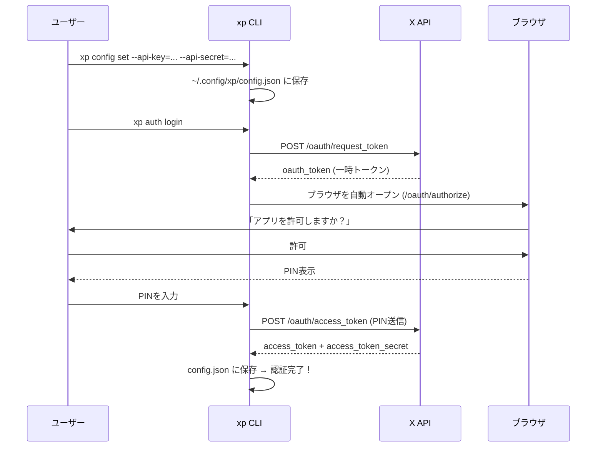
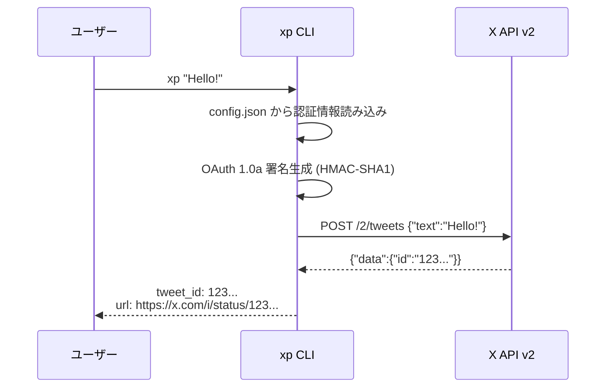
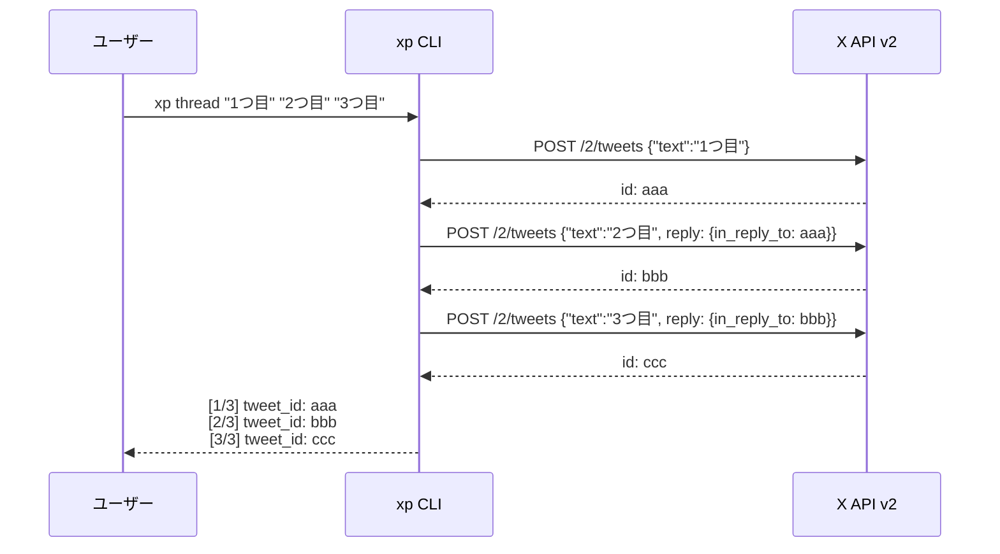
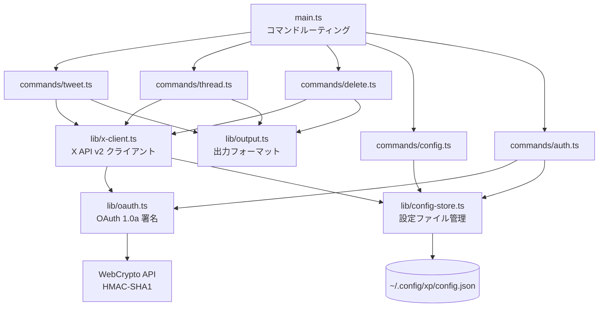

# xp - X (Twitter) CLI Tool

ターミナルからツイートを投稿できるCLIツール。Deno/TypeScript製、依存ゼロ。

```bash
xp "Hello from xp!"
```

## twurl との違い

| | twurl | xp |
|---|---|---|
| ツイート投稿 | `twurl -X POST -H api.twitter.com "/2/tweets" -d '{"text":"Hello"}'` | `xp "Hello"` |
| スレッド | 手動でreply chain構築 | `xp thread "1" "2" "3"` |
| ランタイム | Ruby | 単一バイナリ (依存ゼロ) |
| メンテナンス | 2020年8月以降停滞 | アクティブ |

## インストール

### Deno がインストール済みの場合

```bash
deno install --allow-net --allow-read --allow-write --allow-env --name xp https://raw.githubusercontent.com/tawachan/xp/main/main.ts
```

### ソースからビルド

```bash
git clone https://github.com/tawachan/xp.git
cd xp
deno task compile
# ./xp バイナリが生成される
```

## セットアップ

### 1. X Developer Portal でAPI Keyを取得

1. [Developer Portal](https://developer.x.com/en/portal/dashboard) でアプリを作成
2. App permissions を **Read and Write** に設定
3. **API Key** と **API Secret** を取得

### 2. API Key を設定

```bash
xp config set --api-key=YOUR_API_KEY --api-secret=YOUR_API_SECRET
```

### 3. ブラウザで認証 (OAuth PIN フロー)

```bash
xp auth login
# → ブラウザが自動で開く → Xで「許可」→ PINを入力 → 完了！
```

Access Token / Access Token Secret は自動で取得・保存されます。

> **全部手動で設定したい場合**: `xp config set --api-key=xxx --api-secret=xxx --access-token=xxx --access-token-secret=xxx`

設定は `~/.config/xp/config.json` に保存されます (パーミッション 600)。

## 使い方

```bash
# ツイート投稿
xp "Hello from xp!"
xp tweet "Hello from xp!"

# スレッド投稿
xp thread "最初のツイート" "2番目のツイート" "3番目のツイート"

# ツイート削除
xp delete 1234567890123456789

# 設定確認
xp config show

# ヘルプ
xp help
```

## 出力形式

機械可読なフォーマットで出力します:

```
tweet_id: 1234567890123456789
url: https://x.com/i/status/1234567890123456789
```

## 仕組み

### 認証フロー (OAuth 1.0a PIN-based)



### ツイート投稿フロー



### スレッド投稿フロー



### アーキテクチャ



## 技術仕様

- **Runtime**: Deno 2.x (TypeScript)
- **認証**: OAuth 1.0a (WebCrypto API で自前実装、npm依存ゼロ)
- **API**: X API v2
- **配布**: `deno compile` による単一バイナリ

## ライセンス

MIT
