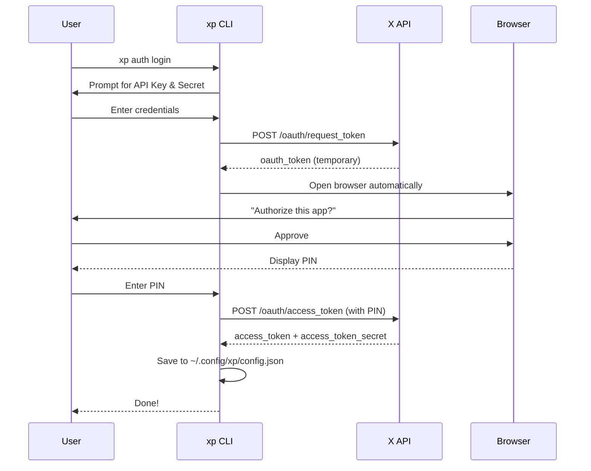
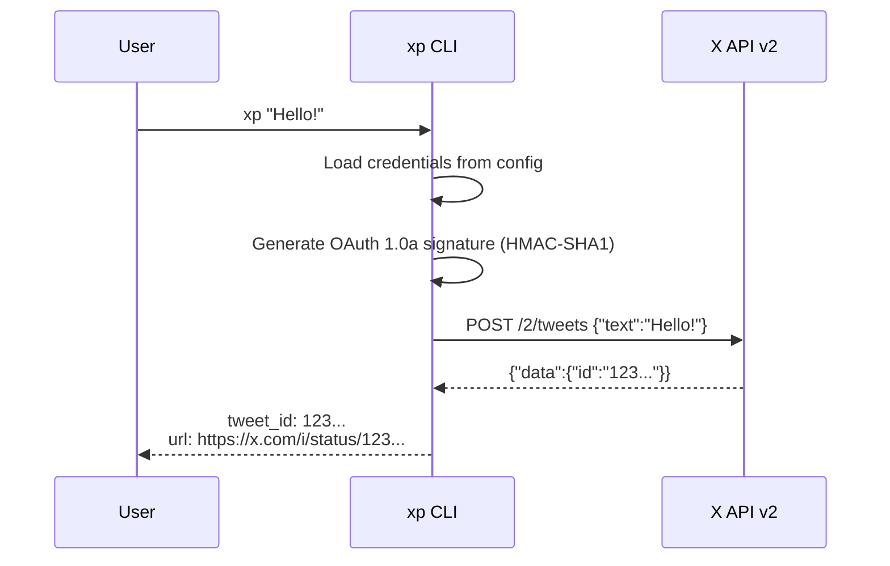
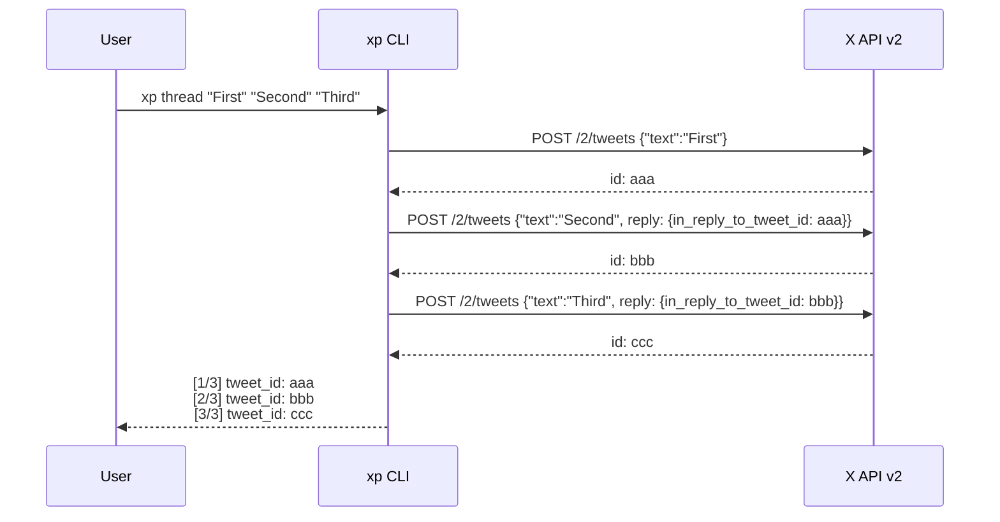
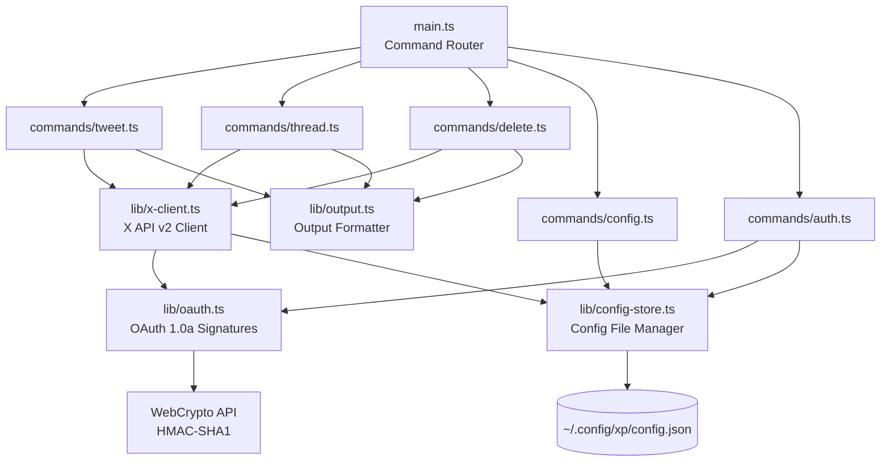

# xp

A fast, minimal CLI for posting to X (Twitter) from your terminal. Built with Deno/TypeScript, zero dependencies.

```bash
xp "Hello, world!"
```

## Why xp?

The official [twurl](https://github.com/twitter/twurl) is a generic API client (curl + OAuth) that requires knowledge of API paths and JSON payloads. Its last release was August 2020.

| | twurl | xp |
|---|---|---|
| Post a tweet | `twurl -X POST -H api.twitter.com "/2/tweets" -d '{"text":"Hello"}'` | `xp "Hello"` |
| Thread | Manually chain reply IDs | `xp thread "1" "2" "3"` |
| Runtime | Ruby | Single binary (zero deps) |
| Maintained | Last release 2020 | Active |

## Installation

### Download binary (recommended)

Download the latest binary from [GitHub Releases](https://github.com/tawachan/xp/releases/latest):

```bash
# macOS (Apple Silicon)
curl -fsSL -L https://github.com/tawachan/xp/releases/latest/download/xp-darwin-arm64 -o /usr/local/bin/xp
chmod +x /usr/local/bin/xp

# macOS (Intel)
curl -fsSL -L https://github.com/tawachan/xp/releases/latest/download/xp-darwin-x64 -o /usr/local/bin/xp
chmod +x /usr/local/bin/xp

# Linux (x64)
curl -fsSL -L https://github.com/tawachan/xp/releases/latest/download/xp-linux-x64 -o /usr/local/bin/xp
chmod +x /usr/local/bin/xp

# Linux (arm64)
curl -fsSL -L https://github.com/tawachan/xp/releases/latest/download/xp-linux-arm64 -o /usr/local/bin/xp
chmod +x /usr/local/bin/xp
```

No runtime dependencies required.

### With Deno

```bash
deno install -g --allow-net --allow-read --allow-write --allow-env --allow-run -n xp https://raw.githubusercontent.com/tawachan/xp/main/main.ts
```

### Build from source

```bash
git clone https://github.com/tawachan/xp.git
cd xp
deno task compile
sudo mv xp /usr/local/bin/
```

### Shell completions

Enable Tab completion for subcommands and flags:

```bash
# Fish
xp completions fish > ~/.config/fish/completions/xp.fish

# Bash
xp completions bash >> ~/.bashrc && source ~/.bashrc

# Zsh
xp completions zsh > "${fpath[1]}/_xp" && compinit
```

## Getting Started

### 1. Create an app on the X Developer Portal

1. Go to [Developer Portal](https://developer.x.com/en/portal/dashboard)
2. Create a new app (Free tier is fine — 1,500 tweets/month)
3. Set App permissions to **Read and Write**
4. Copy your **API Key** and **API Secret**

### 2. Authenticate

```bash
xp auth login
```

That's it. The CLI will:
1. Ask for your API Key and API Secret (first time only)
2. Open your browser to authorize the app on X
3. Ask you to enter the PIN shown on screen
4. Automatically save your Access Token

> **Non-interactive mode** (for CI / AI agents like Claude Code):
> ```bash
> xp config set --api-key=KEY --api-secret=SECRET --access-token=TOKEN --access-token-secret=TOKEN_SECRET
> ```

Credentials are stored in `~/.config/xp/config.json` (chmod 600).

## Usage

### Post a tweet

```bash
xp "Hello from xp!"
xp tweet "Hello from xp!"    # explicit subcommand
```

### Post a thread

```bash
xp thread "First tweet" "Second tweet" "Third tweet"
```

Each tweet is automatically posted as a reply to the previous one.

### Delete a tweet

```bash
xp delete 1234567890123456789
```

### Manage credentials

```bash
xp config show     # Show current config (masked)
xp auth logout     # Remove saved credentials
```

### Help

```bash
xp help
xp version
```

## Output Format

xp outputs machine-readable text, making it easy to use from scripts and AI agents:

```
tweet_id: 1234567890123456789
url: https://x.com/i/status/1234567890123456789
```

Thread output:

```
[1/3]
tweet_id: 1234567890123456789
url: https://x.com/i/status/1234567890123456789

[2/3]
tweet_id: 1234567890123456790
url: https://x.com/i/status/1234567890123456790

[3/3]
tweet_id: 1234567890123456791
url: https://x.com/i/status/1234567890123456791
```

## How It Works

### Authentication Flow (OAuth 1.0a PIN-based)



### Tweet Posting Flow



### Thread Posting Flow



### Architecture



## Technical Details

- **Runtime**: Deno 2.x (TypeScript)
- **Auth**: OAuth 1.0a — implemented from scratch using [WebCrypto API](https://developer.mozilla.org/en-US/docs/Web/API/Web_Crypto_API), zero npm dependencies
- **API**: [X API v2](https://developer.x.com/en/docs/x-api)
- **Distribution**: Single binary via `deno compile`
- **Config**: `~/.config/xp/config.json` (permissions `0600`)

## Development

```bash
# Run in dev mode
deno task dev <args>

# Type check
deno task check

# Compile to binary
deno task compile
```

## Contributing

Contributions are welcome! Please open an issue or submit a pull request.

## License

[MIT](LICENSE)
