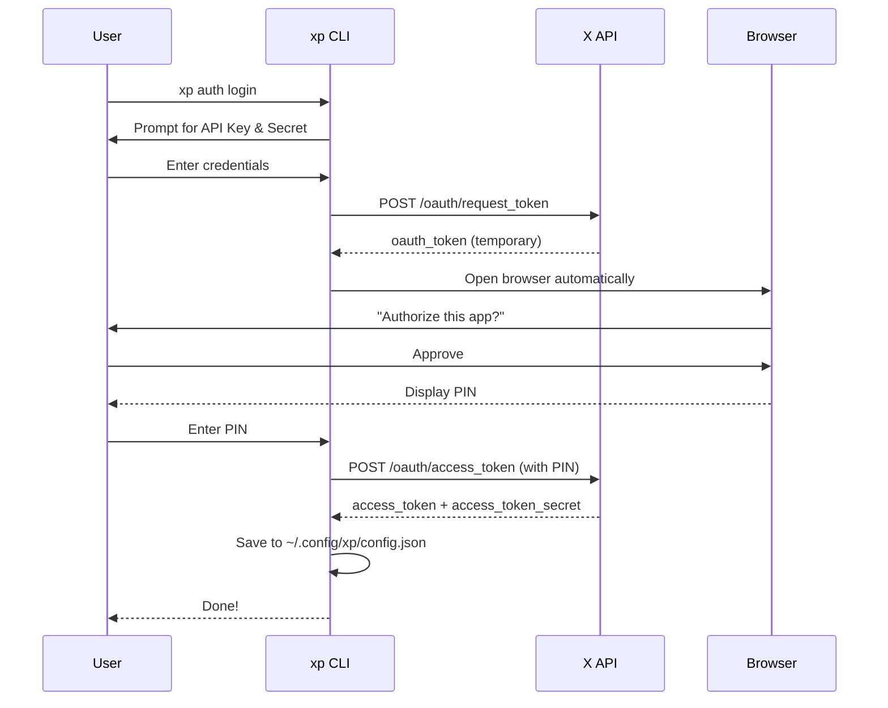
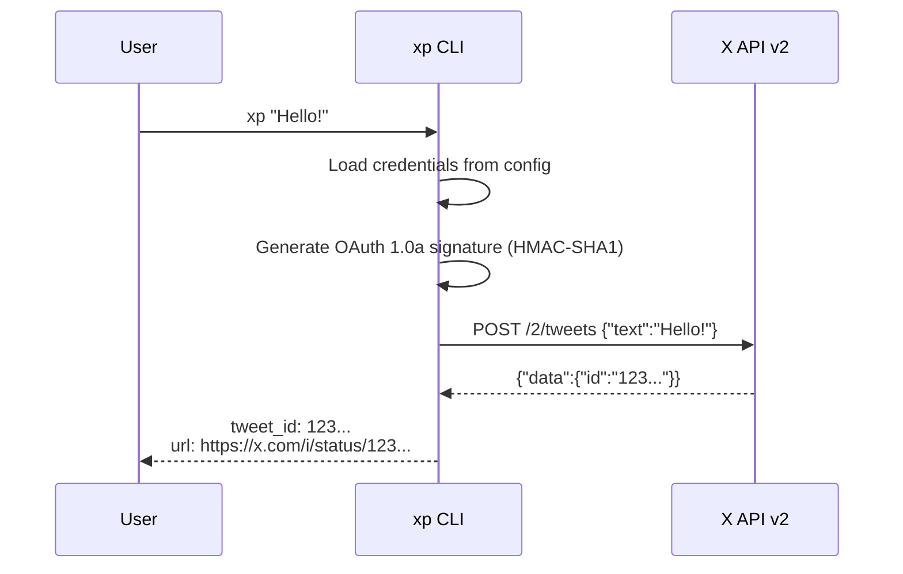
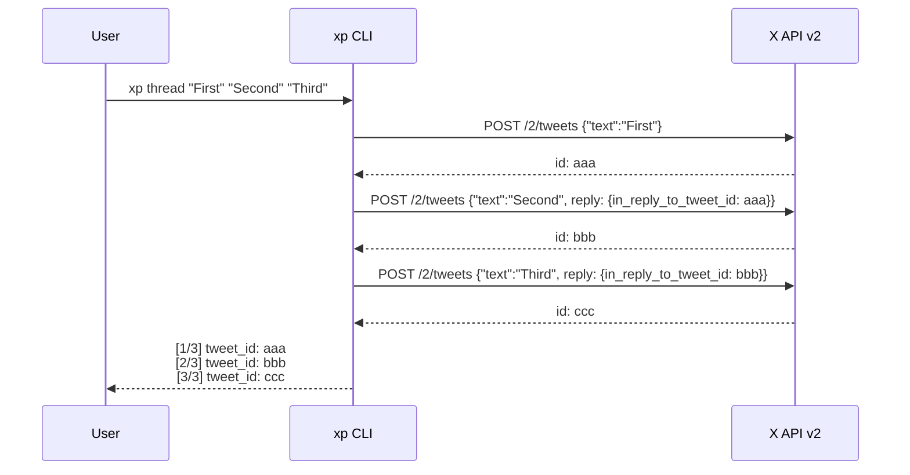
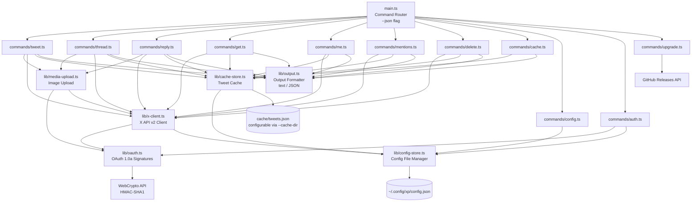

# xp

A personal CLI for everyday tweeting from your terminal — post, thread, reply, and manage your tweets without leaving the command line. Built with Deno/TypeScript, zero dependencies.

```bash
xp "Hello, world!"
```

## Why xp?

The official [twurl](https://github.com/twitter/twurl) is a generic API client (curl + OAuth) that requires knowledge of API paths and JSON payloads. Its last release was August 2020.

| | twurl | xp |
|---|---|---|
| Post a tweet | `twurl -X POST -H api.twitter.com "/2/tweets" -d '{"text":"Hello"}'` | `xp "Hello"` |
| Thread | Manually chain reply IDs | `xp thread "1" "2" "3"` |
| JSON output | Parse raw response yourself | `xp me --json \| jq` |
| Cache | None | Auto-cache — browse offline, save API calls |
| Runtime | Ruby | Single binary (zero deps) |
| Maintained | Last release 2020 | Active |

xp is **not** a comprehensive X API client — it focuses on the tweet operations you actually use every day.

## Installation

### Homebrew (macOS / Linux)

```bash
brew install tawachan/tap/xp
```

### Download binary

Download the latest binary from [GitHub Releases](https://github.com/tawachan/xp/releases/latest):

```bash
# macOS (Apple Silicon)
curl -fsSL -L https://github.com/tawachan/xp/releases/latest/download/xp-darwin-arm64 -o /usr/local/bin/xp
chmod +x /usr/local/bin/xp

# macOS (Intel)
curl -fsSL -L https://github.com/tawachan/xp/releases/latest/download/xp-darwin-x64 -o /usr/local/bin/xp
chmod +x /usr/local/bin/xp

# Linux (x64)
curl -fsSL -L https://github.com/tawachan/xp/releases/latest/download/xp-linux-x64 -o /usr/local/bin/xp
chmod +x /usr/local/bin/xp

# Linux (arm64)
curl -fsSL -L https://github.com/tawachan/xp/releases/latest/download/xp-linux-arm64 -o /usr/local/bin/xp
chmod +x /usr/local/bin/xp
```

No runtime dependencies required.

### With Deno

```bash
deno install -g --allow-net --allow-read --allow-write --allow-env --allow-run -n xp https://raw.githubusercontent.com/tawachan/xp/main/main.ts
```

### Build from source

```bash
git clone https://github.com/tawachan/xp.git
cd xp
deno task compile
sudo mv xp /usr/local/bin/
```

### Shell completions

Enable Tab completion for subcommands and flags:

```bash
# Fish
xp completions fish > ~/.config/fish/completions/xp.fish

# Bash
xp completions bash >> ~/.bashrc && source ~/.bashrc

# Zsh
xp completions zsh > "${fpath[1]}/_xp" && compinit
```

## Getting Started

### 1. Create an app on the X Developer Portal

1. Go to [Developer Portal](https://developer.x.com/en/portal/dashboard)
2. Create a new app ([Pay-Per-Use](https://docs.x.com/x-api/getting-started/pricing) recommended — pay only for what you use)
3. Set App permissions to **Read and Write**
4. Copy your **API Key** and **API Secret**

### 2. Authenticate

```bash
xp auth login
```

That's it. The CLI will:
1. Ask for your API Key and API Secret (first time only)
2. Open your browser to authorize the app on X
3. Ask you to enter the PIN shown on screen
4. Automatically save your Access Token

> **Non-interactive mode** (for CI / AI agents like Claude Code):
> ```bash
> xp config set --api-key=KEY --api-secret=SECRET --access-token=TOKEN --access-token-secret=TOKEN_SECRET
> ```

Credentials are stored in `~/.config/xp/config.json` (chmod 600).

## Usage

### Post a tweet

```bash
xp "Hello from xp!"
xp tweet "Hello from xp!"    # explicit subcommand
```

### Post a thread

```bash
xp thread "First tweet" "Second tweet" "Third tweet"
```

Each tweet is automatically posted as a reply to the previous one.

### Reply to a tweet

```bash
xp reply 1234567890123456789 "Great thread!"
```

### Post with images

```bash
xp "Hello" --image photo.jpg                      # 1 image
xp tweet "Hello" --image a.jpg --image b.jpg       # up to 4 images
xp reply 1234567890123456789 "Nice!" --image r.png # reply with image
xp thread "First" "Second" --image cover.jpg       # image on first tweet
```

Images must be JPG, PNG, GIF, or WebP and under 5 MB each.

### Fetch a tweet

```bash
xp get 1234567890123456789
```

> Requires a paid API plan (Pay-Per-Use or Basic).

### List your recent tweets

```bash
xp me                                      # default: 100 tweets (API max per request)
xp me --limit 20                           # 5-100
xp me --before 1234567890123456789         # older tweets (cursor-based)
xp me --after 1234567890123456789          # newer tweets
xp me --limit 20 --before 1234567890123456789
```

> Requires a paid API plan (Pay-Per-Use or Basic).

### List your mentions

```bash
xp mentions                                    # default: 100 mentions (API max per request)
xp mentions --limit 20                         # 5-100
xp mentions --before 1234567890123456789       # older mentions (cursor-based)
xp mentions --after 1234567890123456789        # newer mentions
xp mentions --limit 20 --before 1234567890123456789
```

All read commands (`get`, `me`, `mentions`) include `author_username` in the output.

> Requires a paid API plan (Pay-Per-Use or Basic).

### Delete a tweet

```bash
xp delete 1234567890123456789
```

### Cache

`xp get`, `xp me`, and `xp mentions` automatically cache fetched tweets locally. Posting (`xp tweet` / `thread` / `reply`) also caches. This reduces paid API calls for previously fetched tweets.

```bash
xp cache list                              # List all cached tweets (newest first)
xp cache list --limit 20                   # Show first 20 cached tweets
xp cache list --year 2026                  # Filter by year
xp cache list --year 2026 --month 1        # Filter by year and month
xp cache show <tweet_id>                   # Show a specific cached tweet
xp cache clear                             # Delete all cached tweets
```

Cache is stored at `~/.config/xp/cache/tweets.json` by default. You can change the cache directory to store tweets alongside your project — useful for versioning cached tweets in a Git repository, sharing them across a team, or keeping project-specific tweet archives:

```bash
xp config set --cache-dir=/path/to/cache    # Use a custom directory (absolute path)
xp config set --cache-dir=~/projects/cache  # ~ is expanded to $HOME
xp config unset --cache-dir                 # Reset to default
```

The path must be absolute (starting with `/` or `~`). Relative paths are rejected to avoid inconsistent behavior across working directories.

`xp delete` also removes the corresponding cache entry.

### Upgrade

```bash
xp upgrade
```

Downloads and installs the latest release from GitHub.

### Manage config

```bash
xp config show                            # Show current config (masked)
xp config set --cache-dir=~/my-cache      # Set custom cache directory
xp config unset --cache-dir               # Reset cache directory to default
xp auth logout                            # Remove saved credentials
```

### Help

```bash
xp help
xp version
```

## Output Format

xp outputs machine-readable text by default, making it easy to use from scripts and AI agents:

```
tweet_id: 1234567890123456789
url: https://x.com/i/status/1234567890123456789
```

### JSON output

Add `--json` to any command for JSON output:

```bash
xp "Hello" --json
# {"tweet_id":"1234567890123456789","url":"https://x.com/i/status/1234567890123456789"}

xp me --json
# [{"tweet_id":"123...","author_id":"456...","author_username":"tawachan39","text":"Hello","created_at":"...","url":"..."},...]

xp me --json | jq '.[0].text'
# "Hello"
```

Errors with `--json` also output JSON to stderr:

```bash
xp get invalid --json
# {"error":"Invalid tweet ID: \"invalid\" (must be a numeric ID)"}
```

## How It Works

### Authentication Flow (OAuth 1.0a PIN-based)



### Tweet Posting Flow



### Thread Posting Flow



### Architecture



## Technical Details

- **Runtime**: Deno 2.x (TypeScript)
- **Auth**: OAuth 1.0a — implemented from scratch using [WebCrypto API](https://developer.mozilla.org/en-US/docs/Web/API/Web_Crypto_API), zero npm dependencies
- **API**: [X API v2](https://developer.x.com/en/docs/x-api)
- **Distribution**: Single binary via `deno compile`
- **Config**: `~/.config/xp/config.json` (permissions `0600`)
- **Cache**: `~/.config/xp/cache/tweets.json` (customizable via `--cache-dir`)

## Development

```bash
# Run in dev mode
deno task dev <args>

# Type check
deno task check

# Compile to binary
deno task compile
```

## Automation & AI Agents

xp can be used from scripts, CI/CD pipelines, and AI agents (like Claude Code). Please follow X's policies:

- **Bot accounts**: If your account primarily posts via automation, X requires your profile bio to disclose it is a bot and who operates it.
- **AI reply bots**: Automated replies using AI (e.g., an AI agent calling `xp reply` without human review) may require [prior written approval from X](https://help.x.com/en/rules-and-policies/x-automation).
- **Human-initiated use**: Asking an AI assistant to compose and post a tweet on your behalf is fine under standard API terms.
- **Spam**: Do not use xp for spam, trend manipulation, or coordinated inauthentic behavior. See [X's automation rules](https://help.x.com/en/rules-and-policies/x-automation).

## Contributing

Contributions are welcome! Please open an issue or submit a pull request.

## Disclaimer

xp is an independent open-source project. It is not affiliated with, endorsed by, or sponsored by X Corp.
Use of this tool is subject to [X's Developer Agreement and Policy](https://developer.x.com/en/developer-terms/agreement-and-policy).
Users are responsible for ensuring their use complies with X's terms of service and applicable laws.

## License

[MIT](LICENSE)
